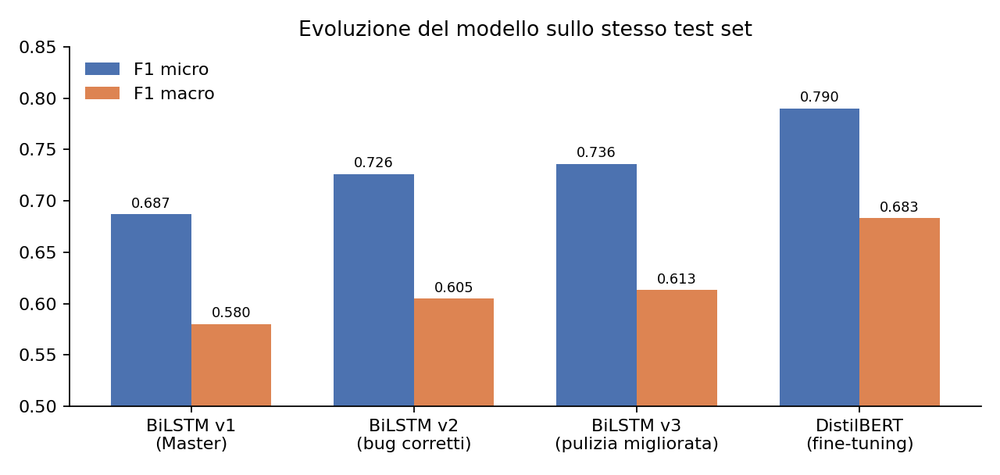
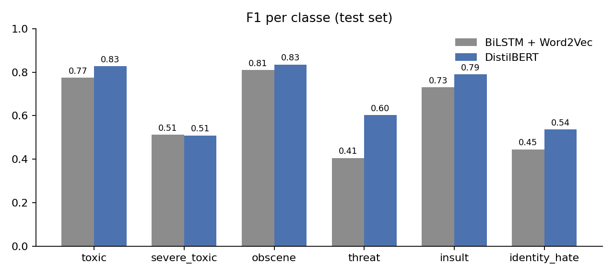

# Filtro anti-haters · classificazione di commenti tossici

Classificazione **multi-label** di commenti online in sei categorie (`toxic`, `severe_toxic`, `obscene`, `threat`, `insult`, `identity_hate`)
sul dataset Jigsaw/Wikipedia (~160.000 commenti in inglese).

Il progetto nasce come esercitazione del Master in AI Engineering (vincolo: **niente Transformer**) e prosegue in tre fasi:
una BiLSTM costruita e corretta con cura, un esperimento controllato per capirne i limiti e il confronto con un Transformer.

**▶ Demo live:** [Hugging Face Spaces](https://huggingface.co/spaces/massimiliano-cantore/filtro-anti-haters)



## Risultati (stesso test set, 15.958 commenti)

| Modello | ROC AUC | F1 micro | F1 macro | F1 con negazione | F1 `threat` |
|---|---|---|---|---|---|
| BiLSTM + Word2Vec, versione del Master | n.d. | 0.687 | 0.580 | n.d. | 0.40 |
| BiLSTM + Word2Vec, bug corretti e soglie per classe | 0.980 | 0.726 | 0.605 | 0.69 | 0.41 |
| BiLSTM + Word2Vec, pulizia del testo migliorata | 0.980 | 0.736 | 0.613 | 0.70 | 0.40 |
| **DistilBERT, fine-tuning** | **0.992** | **0.790** | **0.683** | **0.75** | **0.60** |



## Il percorso

### 1 · BiLSTM + Word2Vec ([notebook](notebooks/01_bilstm_word2vec.ipynb))
Embedding Word2Vec (GoogleNews, 300d), due strati BiLSTM, pesi sui campioni per le classi rare, tuning con Keras Tuner.
Nella revisione ho corretto una serie di problemi della prima versione:

- la pulizia del testo fondeva le parole a capo (`"explanation\nwhy"` → `"explanationwhy"`);
- il tokenizer veniva adattato su tutto il dataset prima dello split (leakage del vocabolario);
- soglia fissa 0.5 → **soglia per classe** scelta sul validation set (+7 punti di F1 macro);
- checkpoint sulla `val_loss`, che con i pesi sui campioni non è confrontabile tra train e validation → checkpoint sulla **`val_auc`**;
- `input()` interattivo, ID del dataset incoerente, artefatti (tokenizer, soglie) non salvati.

### 2 · Esperimento: negazioni e fastText ([notebook](notebooks/02_esperimento_negazioni_fasttext.ipynb))
La BiLSTM sbaglia di più sui commenti con negazioni (F1 0.70 contro 0.76). Ho confrontato quattro varianti a parità di tutto il resto:
marcatura delle negazioni (`don't find offensive` → `dont neg_find neg_offensive`) ed embedding fastText addestrati sui commenti.

**Risultato negativo, ma istruttivo:** nessuna variante migliora oltre il rumore (±1 punto). Il limite è negli **embedding statici**,
che danno un vettore per parola indipendente dal contesto, e non nel preprocessing.

### 3 · DistilBERT ([notebook](notebooks/03_distilbert_finetuning.ipynb))
Fine-tuning di `distilbert-base-uncased` (66M parametri), 2 epoche, 15 minuti su GPU T4.
Le rappresentazioni **contestuali** migliorano tutte le metriche, soprattutto sulle classi rare (`threat` +20 punti di F1).
*"I don't find this offensive at all"* passa da 0.35 (BiLSTM) a 0.00 di probabilità di tossicità.

**Limiti che restano:** gli insulti espliciti negati (*"You are not an idiot"*) vengono ancora segnalati, e `severe_toxic`
resta ferma a F1 ~0.51 con entrambi i modelli, perché il confine con `toxic` è soggettivo già nelle etichette.

## Struttura

```
notebooks/   01 BiLSTM · 02 esperimento negazioni/fastText · 03 DistilBERT (tutti eseguiti, con output)
src/         classe di inferenza ToxicityClassifier
app/         demo Gradio (Hugging Face Spaces)
results/     metriche e grafici
```

## Uso

```bash
pip install -r requirements.txt
```
```python
from filtro_anti_haters.predict import ToxicityClassifier
clf = ToxicityClassifier("massimiliano-cantore/filtro-anti-haters-distilbert")
clf.predict("You are an idiot")[0].labels   # ['toxic', 'obscene', 'insult']
```

I notebook sono pensati per Google Colab (GPU T4). Il dataset non è incluso nel repository:
è il [Jigsaw Toxic Comment Classification Challenge](https://www.kaggle.com/c/jigsaw-toxic-comment-classification-challenge),
da copiare in `MyDrive/Filter_Toxic_Comments_dataset.csv`.

## Stack
Python · TensorFlow/Keras · Keras Tuner · gensim · PyTorch · Hugging Face Transformers · scikit-learn · Gradio

---
Massimiliano Cantore · [LinkedIn](https://www.linkedin.com/in/UTENTE_LINKEDIN)
